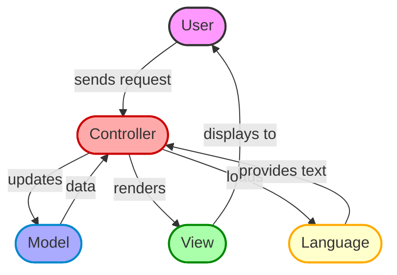
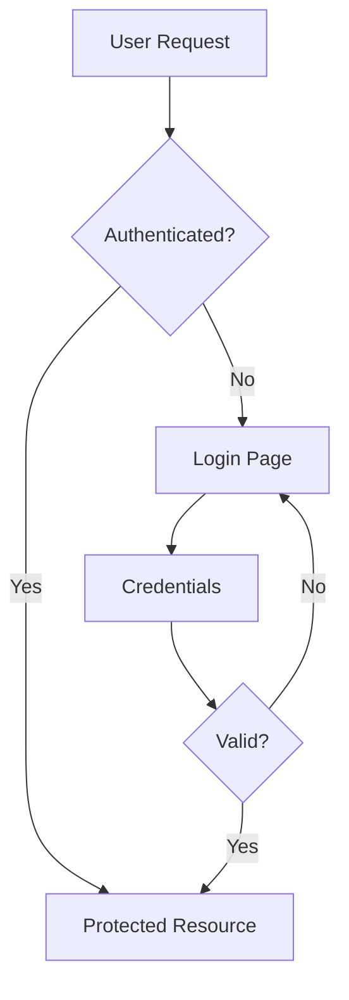

# OpenCart Installation Documentation

<div align="center">
  
  <br/>
  <strong>Version 4.1.0.3</strong>
</div>

## 📑 Table of Contents
- [Overview](#overview)
- [Directory Structure](#directory-structure)
- [Admin Panel](#admin-panel)
- [Catalog (Store Frontend)](#catalog-store-frontend)
- [System Libraries](#system-libraries)
- [System Architecture](#system-architecture)
- [Security Guidelines](#security-guidelines)
- [Maintenance Procedures](#maintenance-procedures)
- [Development Guidelines](#development-guidelines)
- [Support Resources](#support-resources)
- [License](#license)

## 📋 Overview

This is an OpenCart e-commerce platform installation. OpenCart is a free and open-source e-commerce platform that allows you to create and manage your online store.

### Key Features
- 🛍️ Complete e-commerce solution
- 🔒 Secure and reliable
- 🌐 Multi-language support
- 💱 Multi-currency support
- 📱 Responsive design
- 🔌 Extensible architecture

## 📁 Directory Structure

### Root Files

| File | Description | Security Level |
|------|-------------|----------------|
| `config.php` | Main configuration file | 🔒 High |
| `index.php` | Store frontend entry point | 🔒 Medium |
| `cron.php` | Scheduled tasks handler | 🔒 High |
| `error.html` | Error page template | 🔒 Low |
| `php.ini` | PHP configuration | 🔒 High |
| `robots.txt` | Search engine rules | 🔒 Low |

### Main Directories

```plaintext
opencart/
├── admin_panel/     # Administration interface
├── catalog/         # Store frontend
├── system/          # Core system files
├── extension/       # Extensions and modifications
└── image/           # Media storage
```

## 📁 Detailed Folder Structure

### Root Directory
```plaintext
opencart/
├── admin_panel/     # Administration interface
├── catalog/         # Store frontend
├── system/          # Core system files
├── extension/       # Extensions and modifications
├── image/           # Media storage
├── config.php       # Main configuration
├── index.php        # Frontend entry point
├── cron.php         # Scheduled tasks
├── error.html       # Error page
├── php.ini          # PHP settings
└── robots.txt       # Search engine rules
```

### 📂 Admin Panel (`admin_panel/`)
```plaintext
admin_panel/
├── controller/      # Admin controllers
│   ├── catalog/     # Product management
│   ├── cms/         # Content management
│   ├── common/      # Common features
│   ├── customer/    # Customer management
│   ├── design/      # Theme management
│   ├── extension/   # Extension management
│   ├── localisation/# Language/currency
│   ├── marketing/   # Marketing tools
│   ├── report/      # Reports
│   ├── sale/        # Order management
│   ├── setting/     # System settings
│   ├── tool/        # Maintenance tools
│   └── user/        # User management
├── language/        # Admin translations
├── model/          # Admin models
└── view/           # Admin templates
    ├── javascript/ # JS files
    ├── stylesheet/ # CSS files
    └── template/   # Twig templates
```

### 📂 Catalog (`catalog/`)
```plaintext
catalog/
├── controller/     # Frontend controllers
│   ├── account/    # Customer account
│   ├── api/        # API endpoints
│   ├── checkout/   # Shopping cart
│   ├── cms/        # Content pages
│   ├── common/     # Common features
│   ├── product/    # Product pages
│   └── information/# Static pages
├── language/       # Frontend translations
├── model/         # Frontend models
└── view/          # Frontend templates
    ├── javascript/# JS files
    ├── stylesheet/# CSS files
    └── template/  # Twig templates
```

### 📂 System (`system/`)
```plaintext
system/
├── config/        # System configuration
├── engine/        # Core engine files
├── helper/        # Helper functions
├── library/       # Core libraries
│   ├── cache/     # Caching system
│   ├── cart/      # Shopping cart
│   ├── db/        # Database
│   ├── mail/      # Email system
│   ├── session/   # Session handling
│   └── template/  # Template engine
├── framework.php  # Framework loader
├── startup.php    # System startup
└── vendor.php     # Vendor autoloader
```

### 📂 Extension (`extension/`)
```plaintext
extension/
├── opencart/      # OpenCart extensions
│   ├── admin/     # Admin extensions
│   └── catalog/   # Frontend extensions
└── ocmod/         # OCMOD modifications
```

### 📂 Image (`image/`)
```plaintext
image/
├── cache/         # Image cache
├── catalog/       # Product images
├── data/          # Data images
└── system/        # System images
```

## 📝 Folder Usage Instructions

### Admin Panel Usage
1. **Controllers**
   - Place new admin controllers in `admin_panel/controller/`
   - Follow MVC pattern
   - Use proper namespacing
   - Extend base controller

2. **Models**
   - Add new models in `admin_panel/model/`
   - Follow database conventions
   - Use proper validation
   - Implement security checks

3. **Views**
   - Store templates in `admin_panel/view/template/`
   - Use Twig syntax
   - Follow theme structure
   - Include necessary assets

### Catalog Usage
1. **Controllers**
   - Add frontend controllers in `catalog/controller/`
   - Handle user requests
   - Process form submissions
   - Manage sessions

2. **Models**
   - Place frontend models in `catalog/model/`
   - Handle data operations
   - Implement business logic
   - Manage relationships

3. **Views**
   - Store frontend templates in `catalog/view/template/`
   - Use responsive design
   - Follow theme guidelines
   - Optimize performance

### System Usage
1. **Libraries**
   - Core functionality in `system/library/`
   - Extend existing libraries
   - Follow coding standards
   - Document changes

2. **Configuration**
   - System configs in `system/config/`
   - Environment settings
   - Database configuration
   - Cache settings

3. **Engine**
   - Core engine files in `system/engine/`
   - Framework components
   - Base classes
   - System interfaces

### Extension Development
1. **Structure**
   - Create in `extension/opencart/`
   - Separate admin/catalog
   - Include install files
   - Add documentation

2. **Modifications**
   - Use `extension/ocmod/`
   - XML modification files
   - Version control
   - Testing procedures

### Image Management
1. **Organization**
   - Product images in `image/catalog/`
   - System images in `image/system/`
   - Cache in `image/cache/`
   - Data in `image/data/`

2. **Optimization**
   - Use proper formats
   - Implement caching
   - Optimize sizes
   - Maintain structure

## 🔧 Maintenance Guidelines

### File Permissions
```bash
# Admin Panel
chmod 755 admin_panel/
chmod 644 admin_panel/*.php

# Catalog
chmod 755 catalog/
chmod 644 catalog/*.php

# System
chmod 755 system/
chmod 644 system/*.php

# Extensions
chmod 755 extension/
chmod 644 extension/*.php

# Images
chmod 777 image/
chmod 777 image/cache/
chmod 777 image/catalog/
```

### Backup Procedures
```bash
# Database Backup
mysqldump -u [user] -p [database] > backup.sql

# File Backup
tar -czf opencart_backup.tar.gz \
    --exclude='image/cache/*' \
    --exclude='system/storage/cache/*' \
    --exclude='system/storage/logs/*' \
    .
```

### Security Measures
1. **File Protection**
   - Protect config files
   - Secure admin directory
   - Restrict access to system
   - Monitor file changes

2. **Directory Security**
   - Use .htaccess rules
   - Implement IP restrictions
   - Enable SSL
   - Regular audits

## 👨‍💼 Admin Panel

### Controllers

#### 📊 Dashboard & Management
| Module | Description | Access Level |
|--------|-------------|--------------|
| Catalog | Product & category management | Admin |
| CMS | Content management system | Admin |
| Customer | Customer data management | Admin |
| Design | Theme & layout management | Admin |
| Extension | Module management | Super Admin |
| Localisation | Language & currency settings | Admin |
| Marketing | Promotions & campaigns | Admin |
| Reports | Analytics & statistics | Admin |
| Sales | Order management | Admin |
| Settings | System configuration | Super Admin |
| Tools | Maintenance utilities | Super Admin |
| Users | User management | Super Admin |

### Models
```php
// Example Model Structure
class ModelCatalogProduct extends Model {
    public function getProduct($product_id) {
        // Product retrieval logic
    }
    
    public function addProduct($data) {
        // Product creation logic
    }
}
```

### Views
```plaintext
admin_panel/view/
├── javascript/    # JS files
├── stylesheet/    # CSS files
└── template/      # Twig templates
```

## 🛍️ Catalog (Store Frontend)

### Controllers

#### 🛒 Shopping Features
| Feature | Description | File Location |
|---------|-------------|---------------|
| Cart | Shopping cart management | `catalog/controller/checkout/cart.php` |
| Checkout | Order processing | `catalog/controller/checkout/checkout.php` |
| Product | Product display | `catalog/controller/product/product.php` |
| Category | Category listing | `catalog/controller/product/category.php` |

#### 👤 Customer Features
| Feature | Description | File Location |
|---------|-------------|---------------|
| Account | Customer account | `catalog/controller/account/account.php` |
| Login | Authentication | `catalog/controller/account/login.php` |
| Register | Registration | `catalog/controller/account/register.php` |
| Order | Order history | `catalog/controller/account/order.php` |

### Frontend Features

#### 📱 Responsive Design
```css
/* Example responsive breakpoints */
@media (max-width: 768px) {
    /* Mobile styles */
}
@media (min-width: 769px) and (max-width: 1024px) {
    /* Tablet styles */
}
@media (min-width: 1025px) {
    /* Desktop styles */
}
```

#### 🔍 Search & Navigation
```javascript
// Example search functionality
$(document).ready(function() {
    $('#search').autocomplete({
        'source': function(request, response) {
            // Search logic
        }
    });
});
```

## 🛠️ System Libraries

### Core Libraries

#### 📦 Cache System
```php
// Example cache usage
$cache->set('key', $data, 3600);  // Cache for 1 hour
$data = $cache->get('key');
```

#### 💳 Cart System
```php
// Example cart operations
$cart->add($product_id, $quantity);
$cart->update($cart_id, $quantity);
$cart->remove($cart_id);
```

### Utility Libraries

| Library | Purpose | Example Usage |
|---------|---------|---------------|
| Image | Image manipulation | `$image->resize(100, 100)` |
| Mail | Email sending | `$mail->send()` |
| Log | Error logging | `$log->write($message)` |
| URL | URL generation | `$url->link('product/product')` |

## 🏗️ System Architecture

### MVC + Language Flow Diagram



### MVC Pattern

```plaintext
Request Flow:
Client Request → Controller → Model → View → Response
```

#### 🔄 Event System
```php
// Example event registration
$event->register('controller/*/before', new Action('event/debug/before'));
$event->register('controller/*/after', new Action('event/debug/after'));
```

### Security Features

#### 🔒 Authentication Flow


## 🛡️ Security Guidelines

### File Permissions
```bash
# Recommended permissions
chmod 644 config.php
chmod 755 admin/
chmod 777 image/
chmod 777 system/storage/
```

### Security Checklist
- [ ] SSL Certificate installed
- [ ] Admin directory renamed
- [ ] Strong passwords set
- [ ] File permissions configured
- [ ] Error reporting disabled
- [ ] Backup system in place

## 🔧 Maintenance Procedures

### Regular Tasks
```bash
# Example backup script
mysqldump -u user -p database > backup.sql
tar -czf files.tar.gz /path/to/opencart
```

### Monitoring
```php
// Example error logging
$log->write('Error: ' . $error_message);
```

## 💻 Development Guidelines

### Coding Standards
```php
// PSR-4 Autoloading Example
namespace Opencart\Catalog\Controller\Account;
class Login extends \Opencart\System\Engine\Controller {
    public function index() {
        // Controller logic
    }
}
```

### Extension Development
```php
// Example extension structure
extension/
└── my_extension/
    ├── admin/
    ├── catalog/
    └── install.json
```

## 📚 Support Resources

### Official Resources
- 🌐 [OpenCart Website](https://www.opencart.com)
- 📖 [Documentation](https://docs.opencart.com)
- 💬 [Forums](https://forum.opencart.com)
- 📦 [GitHub Repository](https://github.com/opencart/opencart)

### Community Resources
- 🎥 Video Tutorials
- 📝 Blog Posts
- 👥 User Groups
- 🛠️ Developer Tools

## 📄 License

OpenCart is released under the GNU General Public License v3.0
